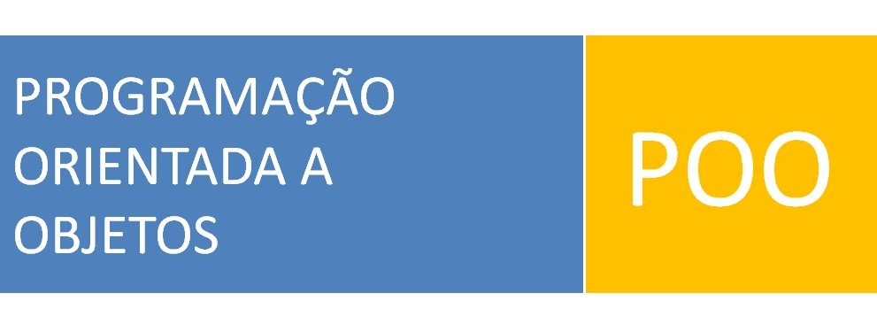

# PROGRAMAÇÃO ORIENTADA A OBJETOS

Fornecer condições suficientes para a implementação de softwares que utilizem a arquitetura cliente-servidor em redes locais e na Internet, com o uso de uma linguagem de programação orientada a objetos. Introdução à orientação a objetos. Conceitos básicos e terminologia de Programação orientada a objetos. Linguagens típicas orientadas a objetos. Desenvolvimento de aplicações em uma linguagem orientada a objetos. 

## Conteúdo

* Introdução à Linguagem Java através de exemplos
  * Exemplos de pequenos programas em java que evidenciem: tipos básicos, decisões e laços, (mas não métodos para evitar métodos estáticos), compilação e execução, IDE, constantes, documentação. Entrada de dados.
 
* Criação de classes e Uso de objetos
  * Introdução à OO, conceito de objeto no mundo real, no mundo de software OO, diferenças entre mundo real e software, modelo, atributos, comportamento, responsabilidade, Padrão de Projeto Expert, instanciação e uso de objetos, classe de objeto, construtor, referência, métodos e envio de mensagem, encapsulamento, Identidade de objetos, uso de várias classes, overload, método de classe, persistência, tudo é um objeto, while e switch, referência nula, curto circuito.  Exemplos de pequenos programas em java que evidenciem: métodos-padrão, sobrecarga.
 
* Coleções de Objetos
  * Exemplos de pequenos programas em java que evidenciem: conceito de coleção, comportamento de uma coleção, iteração via índice, for-each, cast, iteração sequencial em uma coleção. API’s Java: Collection, ArrayList, Set 
 
* Tratamento de Erros usando Exceções
  * Exemplos de pequenos programas em java que evidenciem: exceções, sem criar nova exceção
 
* Reuso com Herança
  * Exemplos de pequenos programas em java que evidenciem: classes implementando a mesma interface, fatoramento de implementação criação de hierarquias de classes, classes abstratas, override, programming by difference, casting, upcast e downcast
 
* Interfaces e Polimorfismo
  * Exemplos de pequenos programas em java que evidenciem: a interface como tipo abstrato de dado (que define apenas comportamento) polimorfismo: fazendo com que o código cliente se amarre a uma interface e não a implementação

* Visibilidade
  * Unordered sub-listExemplos de pequenos programas em java que evidenciem: encapsulamento revisitado, visibilidade, packages.

* Arquivos
  * Apresentaremos neste tópico como se trabalhar com arquivos em JAVA. Alguns pequenos exemplos ilustram o assunto.

* Threads
  * O que são Threads. Implementação de Threads. Ciclo de vida de um Thread. Escalonamento de Threads. Sincronização de Threads. Pool de Threads.

* Sockets
  * Comunicação entre processos com Sockets. Implementação de Sockets TCP. Implementação de Sockets UDP.

## Avaliações

A nota final será computada através da média ponderada das avaliações:

* Avaliação I: Projeto (apresentações, diários de bordo e acompanhamento do projeto no Taiga) - 60%
* Avaliação II: Exercício prático sobre Criação de classes e coleções. - 10%
* Avaliação III: Atividade prática sobre a classe String e formatação de saídas. - 10%
* Avaliação IV: Atividade prática sobre o Framework Collections. - 10%
* Avaliação V: Servidor Socket. - 10%

### Trabalho
* Projeto: [A especificação do projeto](Em breve).

## Comunicação
Toda a comunicação será realizada usando o 

## Bibliografia

### Bibliografia Básica

 

### Bibliografia Complementar

 

E para completar ainda mais a listagem existe estes [exemplares](http://jsbooks.revolunet.com/) como outros indicações.
